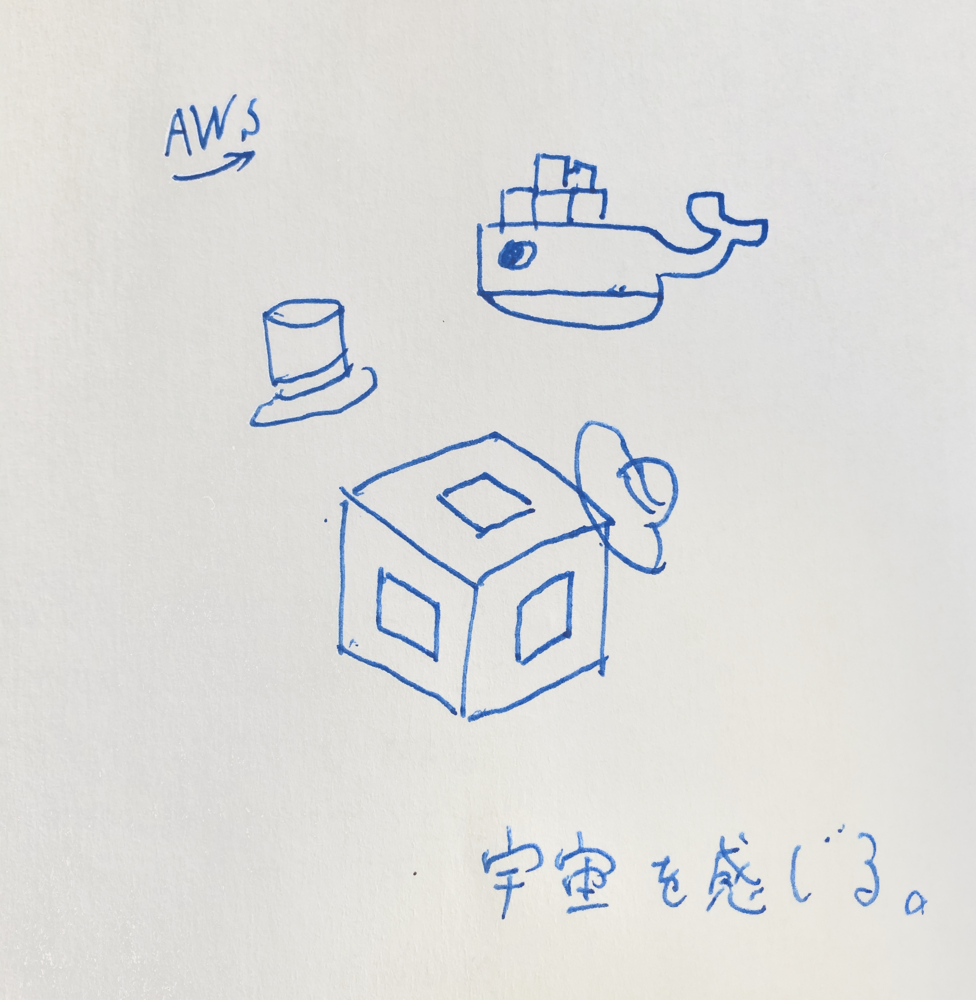
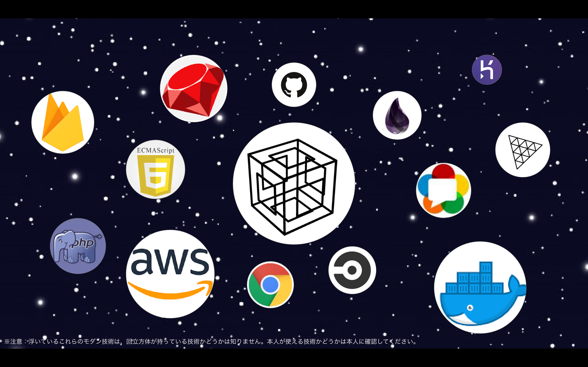
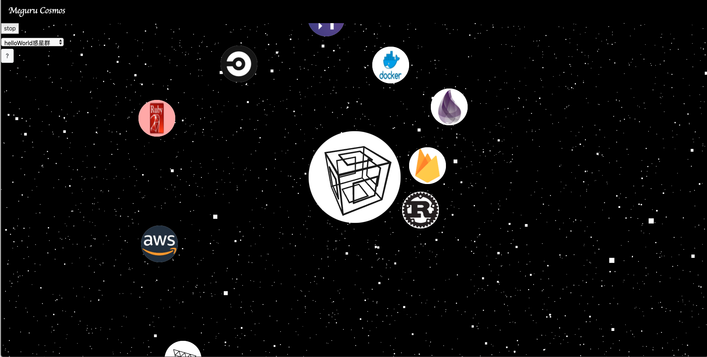

# lonely hackathon #01
## meguru_rotation
回転する回立方体

※以下、ニッシー☆がお送りします。

- 作品リンク：https://lonely1.yukinissie.com
- ハッカソンリンク：https://hackz.connpass.com/event/176909/

概要

## コンセプト
宇宙感ある空間からモダン技術への入り口を回立方体とお届け

## コンセプト画像1

## コンセプト画像2

- ※注意1：浮いているこれらのモダン技術は、回立方体が持っている技術かどうかは知りません。本人が使える技術かどうかは本人に確認してください。
- ※注意2：モダン技術の定義は曖昧です。今回は雰囲気をお楽しみください。

## どんなコンテンツか？
- 新鮮で熱いWeb系モダン技術が何か、視覚的にわかる。
- すぐにモダン技術に、Joinできる。

## 誰向けのコンテンツか？
- Web系モダン技術に関心を持っている人。
- 駆け出しWebエンジニア。

## 要件
- Webブラウザでアクセス可能（PC推奨）
- 作品リンク：https://lonely1.yukinissie.com

## 使い方
- 気になる技術のアイコンをクリックする。
- 惑星を止めたかったら画面左上の「stop」ボタンをクリックしてください。
- （なお、回立方体は止まることを知りません。進み続けます。）
- 以上です！（笑）

## スクリーンショット

## 結果
- 宇宙ぽいモダン技術？の惑星群ができた。
- リファレンスやhelloWorldの記事にアクセスできる。
- 投稿機能はありません。。（バックが組めなかったので😭😭）

## 感想
- 1人ハッカソン、飛び入りだったけど最高でした！ありがとうございます😊
- 改めて、フロント技術の広大さと、書いている人の器用さが身に染みます。

## 使用技術
- Three.js
- Blender
- bootstrap
- 生JavaScript
- Amazon EC2（手動デプロイ）etc..

